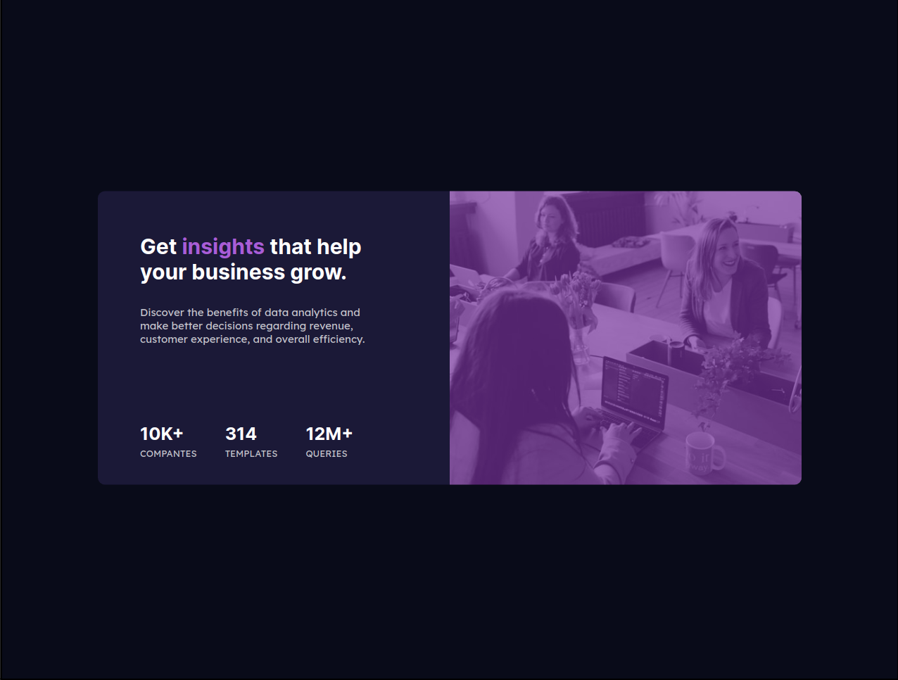

# StatsPreviewCardComponent

## Sobre o projeto

Esta é uma solução do frontend Mentor que tem como objetivo a construção um Componente de cartão de visualização estatico e torná-lo o mais semelhante possível ao projeto original. Nele, o usuário deve ser capaz de visualizar o cartão em qualquer dispositivo.

## Layout Desktop

## layout Mobile

# Estilização utilizada

## Cores

### Primária

- Very dark blue (main background): hsl(233, 47%, 7%)
- Dark desaturated blue (card background): hsl(244, 38%, 16%)
- Soft violet (accent): hsl(277, 64%, 61%)

### Neutra

- White (main heading, stats): hsl(0, 0%, 100%)
- Slightly transparent white (main paragraph): hsla(0, 0%, 100%, 0.75)
- Slightly transparent white (stat headings): hsla(0, 0%, 100%, 0.6)

## tipografia

### Body

- Font size: 15px

### Font

- Family: Inter
- Weights: 400, 700

- Family: Lexend Deca
- Weights: 400

# Tecnologias utilizadas

## Front end

- HTML / CSS 

Modelo de Layout:

- Css FlexBox

## Implantação em produção

- Front end web: Netlify
  
  https://statspreviewcard1.netlify.app/
  
# Meu aprendizado neste projeto
  
  Neste projeto aprendi a utilizar o background-color sobre uma imagem, e pratiquei os conceitos de responsividade. Também comecei a utilizar o FlexBox para melhor manipulação do layout do documento. 
  
# Autor

Wesley higino Pereira

https://www.linkedin.com/in/wesleyhigino/